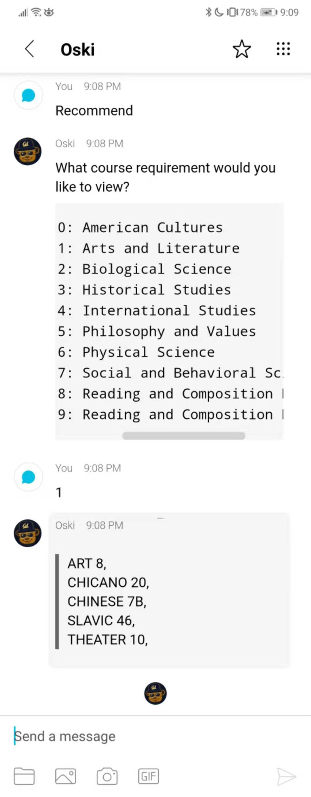

# OskiBot - An all-purpose chatbot for UC Berkeley students
**Inspired by Oski, the best collegiate mascot in America**


## How to Deploy on the Web using Microsoft Azure

1. From a Mac/Linux bash shell:

    ```shell
    git clone https://github.com/mbzhu1/oskibot
    cd oskibot
    npm install
    ```

2. Create a Bot account at ['Webex for Developers'](https://developer.webex.com/add-bot.html), and copy your bot's access token to the clipboard. Set the ACCESS_TOKEN in the .env file to your bot's access token

3. Set up a Azure Account and download Visual Studio Code

4. Install the Azure App Service Extension in VS Code

5. Follow the instructions at https://docs.microsoft.com/en-us/azure/app-service/app-service-web-get-started-nodejs#deploy-to-azure to deploy your app to azure.

6. If you browse the URL given by Azure, you may find that there is an error page. Don't panic, this is expected. After recieving a URL from Azure, replace the PUBLIC_URL in the .env file with your web app's URL. Save the changes and redeploy your chatbot.

7. The URL given to you by Azure should now display a JSON file with the health status report about the chatbot. If you are on Chrome, you can download [JSON VIEWER](https://chrome.google.com/webstore/detail/json-viewer/gbmdgpbipfallnflgajpaliibnhdgobh) to view the file in a more readable format

8. Now you have your bot deployed onto the web and you can start talking with your bot in Cisco Webex Teams!

## How to run locally

1. From a Mac/Linux bash shell:

    ```shell
    git clone https://github.com/mbzhu1/oskibot
    cd oskibot
    npm install
    ```

2. Launch ngrok to expose port 3000 of your local machine to the internet:
    ```shell
    ./ngrok http 3000
    ```
And keep this running in the background

3. Change the PUBLIC_URL in the .env file to be the url given by ngrok and make sure to pick the HTTPS address that ngrok is now exposing. Note that ngrok exposes HTTP and HTTPS protocols, make sure to pick the HTTPS address.

4. Create a Bot account at ['Webex for Developers'](https://developer.webex.com/add-bot.html), and copy your bot's access token to the {your bots access token}

    ```shell
    ACCESS_TOKEN={your bots access token} node bot.js
    ```
5. Now you have your bot running!

6. Go to the Cisco Webex Teams application, search up your chat bot using the Bot's username, and start chatting!


## Features
OskiBot can currently give you course reccomendations, set Google Calendar reminders, and show online lecture videos

If you ask OskiBot to recommend courses, he will help you filter courses based on graduation requirments

If you ask OskiBot to set a reminder, he we direct you to https://midterm-reminders-s8d1h.transposit.io which uses Transposit to connect to the Google Calendar API

If you ask OskiBot to show you online lectures, he will direct you to https://mbzhu1.github.io/cs61a-eluvio-trial/ which is currently using the Eluvio API to deliver video content via blockchain technology.




